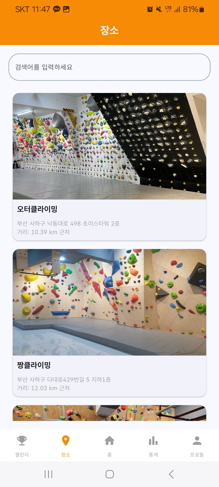

> # 🔖 목차
> ## ✨[프로젝트 소개](#-프로젝트-소개)
>
> ## 💡[기획 배경](#-기획-배경)
>
> ## 👫[대상](#-대상)
> 
> ## 🎉[기대 효과](#-기대-효과)
>
> ## 🔉[주요 기능](#-주요-기능)
>
> ## 🔧[기술 스택](#-기술-스택)
>
> ## 👥[팀원 소개](#-팀원-소개-및-역할-분담)
> 
> ## 📁[프로젝트 산출물](#-프로젝트-산출물)
>
> ## <a href="https://github.com/dh0728/ssafy_common_2/blob/master/README.md#%EF%B8%8F-%EC%84%9C%EB%B9%84%EC%8A%A4-%ED%99%94%EB%A9%B4-1">🖼️ 서비스 화면</a>
>
> ## 📁[프로젝트 회고](#-프로젝트-회고)

## ✨ 프로젝트 소개

<h1>오르는 즐거움! 끌락끌락</h1>

<pre background-color="#dbdbdb">

<h2>클라이밍을 취미로 즐길 수 있는 앱</h2>
<h3>
'클라이밍 종목 유형 중 볼더링 종목에 초점을 맞추어 서비스 구현' 
자신의 클라이밍 영상을 촬영하여 SNS 에 업로드 하여 기록하는 클라이밍족의 문화에 착안하여, 송진가루를 손에 묻혀 진행하는 점에서 본인의 휴대전화가 더럽혀질 수 있다는 점을 기반으로 모션 인식을 통한 기록 자동화, 윙스펜 AI 기술을 활용한 팔길이 측정, 클라이밍장 3D 모델링 기술 등을 해당 앱에 녹여냈습니다.
</h3>

</pre>

## 💡 기획 배경
- 클라이밍을 취미로 하는 사람들을 위해
- 더 편하게 클라이밍을 즐길 수 있도록

## 👫 대상
- 평소 클라이밍을 즐겨하는 사람
- 자신의 클라이밍 기록을 기록하는 사람
- 자신의 기록 및 성장을 눈으로 확인하고 싶은 사람
 
## 🎉 기대 효과
- 클라이밍장 정보를 더 쉽게 조회 
- 기록 저장을 자동으로 보기 쉽게
- 영상 쵤영을 더 쉽고 간편하게

## 🔉 주요 기능
📏 이미지를 통한 윙스팬 측정

🎬 모션인식 + 기록 자동화

🌠 클라이밍장 볼더 3D 이미지 제공

✏️ 캘린더 + 통계를 통한 기록 관리

## 🔧 기술 스택
### 백엔드
     

### 프론트엔드
   

### 인프라
   

### 커뮤니케이션
    

## 👥 팀원 소개 및 역할 분담

<table >
    <thead>
        <tr>
            <th align="center">도경록(팀장) - FE</th>
            <th align="center">김한민 - FE</th>
            <th align="center">도경원 - FE</th>
        </tr>
    </thead>
    <tbody>
        <td align="center">
            
        </td>
        <td align="center">
            
        </td>
        <td align="center">
            
        </td>
    </tbody>
</table>
<table >
    <thead>
        <tr>
            <th align="center">송동현 - BE</th>
            <th align="center">이지연 - BE</th>
            <th align="center">정영한 - BE</th>
        </tr>
    </thead>
    <tbody>
        <td align="center">
            
        </td>
        <td align="center">
            
        </td>
        <td align="center">
            
        </td>
    </tbody>
</table>

해당 프로필 사진을 클릭하면 해당 팀원의 깃허브로 이동합니다.

## 📁 프로젝트 산출물 

  
와이어프레임

### 🔒 1. 로그인

#### 1.1 로그인

### 📅 캘린더

### 😆 마이페이지

### 🔎 클라이밍 조회

### 🎸 챌린지

### 📽️ 영상

### 🎞️ 앨범

### 📊 통계

  
ERD

  

  
API 명세서

  
   
 
  
   
  
  
   
  
   
 
  
   
  
  
   
  
  

  
아키텍처

  

  
UCC

  <a href="https://youtu.be/1qiozCS53VE">UCC</a>

## 🖼️ 서비스 화면

### 📌 1. 로그인
- 일반 로그인

- 소셜 로그인(카카오)

### 📌 2. 캘린더
- 날짜별 클라이밍 기록을 확인 할 수 있습니다.

### 📌 3. 마이페이지
- 개인 정보 수정 및 리치를 측정할 수 있습니다.

### 📌 4. 클라이밍장 조회
- 클라이밍장 상세 정보를 조회 할 수 있습니다.

### 📌 5. 클라이밍장 해금
- 클라이밍장에 일정거리 이내에 있을시 클라이밍장이 해금됩니다.

### 📌 6. 영상
- 모션인식을 통해 터치없이도 영상을 촬영하고 저장할 수 있습니다.
- 음성 안내에 따라 색상선택 및 촬영을 시작합니다. 
- 오른손 들기 : 자동촬영시작
- 박수 : 색상 선택
- 두손들기 : 촬영 시작
- O or X : 성공, 실패 선택

### 📌 7. 통계
- 년, 월, 주별로 기록 통계를 확인할 수 있습니다.

## 📁 프로젝트 회고
#### 😎 송동현
전부터 관심이 있었던 Spring 프레임워크에 대해 공부하고 알아갈 수 있었던 프로젝트였습니다. Spring 자체가 처음이다보니 많은 어려움이 있었지만 그만큼 새로운 것을 많이 배울 수 있어 뜻 깊고 즐거운 프로젝트 였었던 같습니다. 프로젝트를 진행하면서 여러 아쉬웠던 점이 있는데요. 먼저 성능 최적화 부분입니다. 데이터를 조회하는 한번의 트랜젝션에서 여러 테이블을 Join하면서 발생하는 복잡한 쿼리로 인해 조회 성능이 좋지 않았습니다. 다음 프로젝트에서는 쿼리 최적화, 인덱싱 같은 여러 기술을 적용해 기능을 개선하고 싶다는 생각이 들었습니다.  
코드를 작성하면서 재사용이 가능하도록 코드를 작성해 좀 더 코드를 효율적으로 작성해볼수 있는 부분이 있지않았을까 하는 생각이 들었습니다. 또한 코드를 작성할 때 기능단위로 좀더 코드를 쪼개서 코드를 작성하고 변수명이나 코드를 좀 더 깔끔하게 작성했다면 다른 팀원들이 나의 코드를 작성했을 때 이해하는데 도움이 되지 않았을까하는 생각이 들었습니다. 개발을 할수록 시간에 쫒겨 기능 구현을 우선으로 급하게 코드를 짜다보니 이런 아쉬운 점이 많이 남았던 거 같습니다. 앞으로는 초반 설계나 클린 코드에 대해 좀 더 공부하고 깔끔하게 코드를 짜도록 해야겠다는 생각이 들었습니다.

